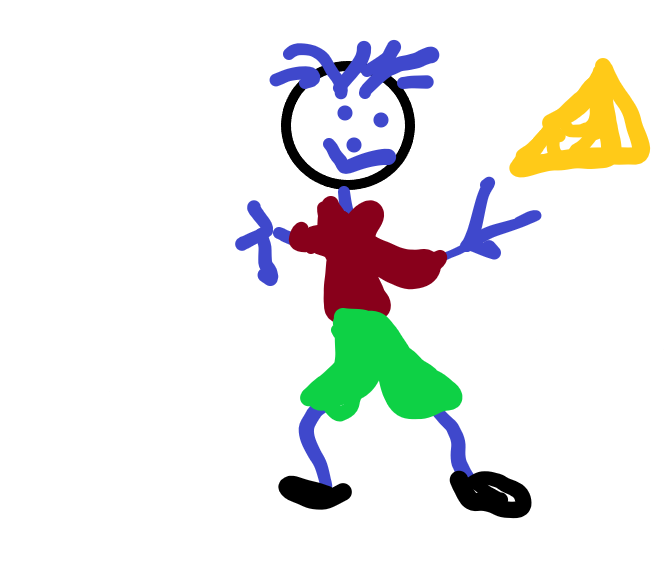

 

## Report time

Started with gathering the template from the exemplar and the marking schedule from the course outline. Smashed them together headed up my word document.
For the next week I will slowly begin filling out a section one or two days at a time, each section requires extensive research to help me understand what to place under each header. They are all headers that can go into a lot of depth if you have time.
Executive summary is normally what I would do last therefore starting from the Introduction and working my way through the report from there is where it all begins.

### User Requirements

The general or specific functionality
_The goal is to have an **online auction** function on Bull power website_

Not adding specific requirements to Bull power auction site could spell the end for this project the following are some general functionality requirements or behavior of a function when specific conditions are met. Overall if the user interfaces are adaptable and user friendly there will less issues for the all involved.

- Business Rules
- Authentication
- Certification Requirements
- Transaction corrections

To be frank this is a big topic the above is barely touching the surface and there are quite a lot of non-functional requirements of the systems quality such as modifying data in a database that should be updated for all useres accessing this information within secs that can effect user experience, therefore some of the following issues include

- Performance - response time
- Security
- Usability
- Reliability
- Scalability

and the list goes on!

We have yet to cover this section in class - till then I will revisit this section in the future

### Site Goals

The Mission of the Dairy collective is to simply increase market share of dairy manufacturer. The short goal is to provide a prototype online auction function with a cheese quality calculator. The customers will need to be able to log in to bid and users administer their accounts.
The long term goal is striving to have a positive impact on customers and small businesses.

That is all for now - Have yet to revisit Vue.js tutorial it has been started but not finished

## Todo list:

- [ ] Understand Express.js _Not had a chance to sink into this appears complicated_
- [x] [Install Express.js](<(https://github.com/terlici/base-express)>) - **_this is a git repo with express_**
- [ ] login and authenticaton - _Need to make time to have a play_
- [x] Buff out a section in the report - assignment2
- [x] Have a nose at some of the provided resources - Moodle
- [ ] find another framework to look into - _have Vue.js and maybe React hoping to look at Native and ....??_
- [x] Install the latest version Node.js _completed this task in class, the day of Express.js tut_
